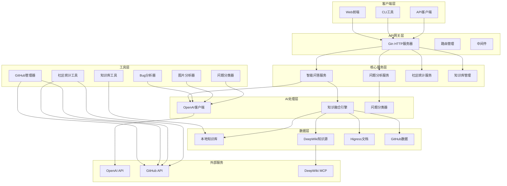
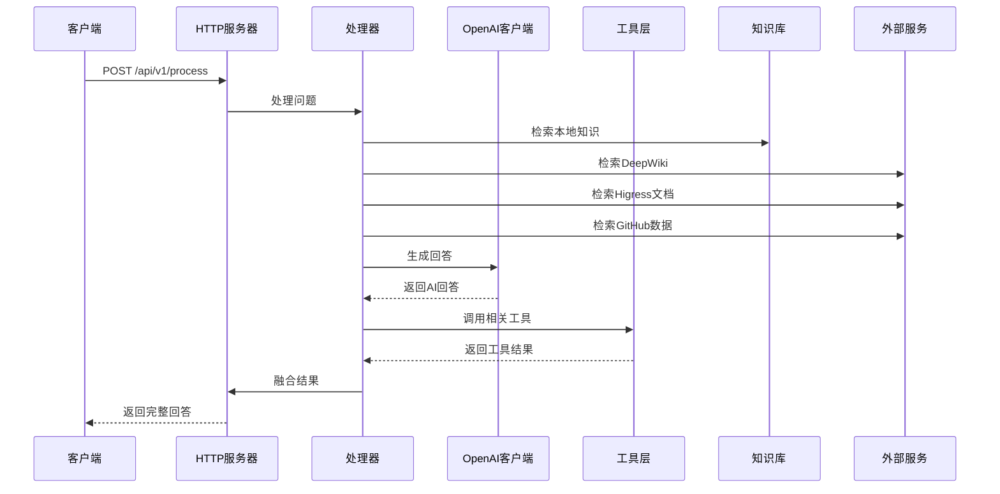
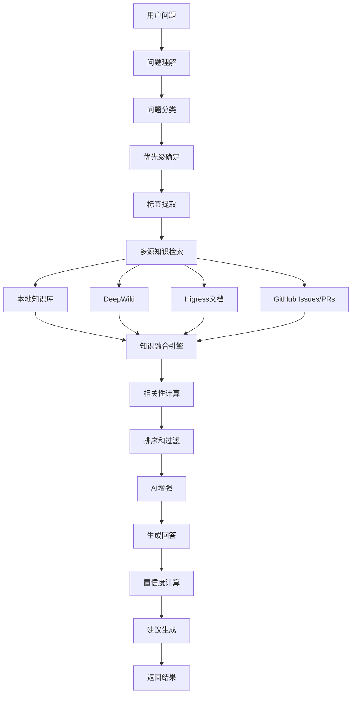
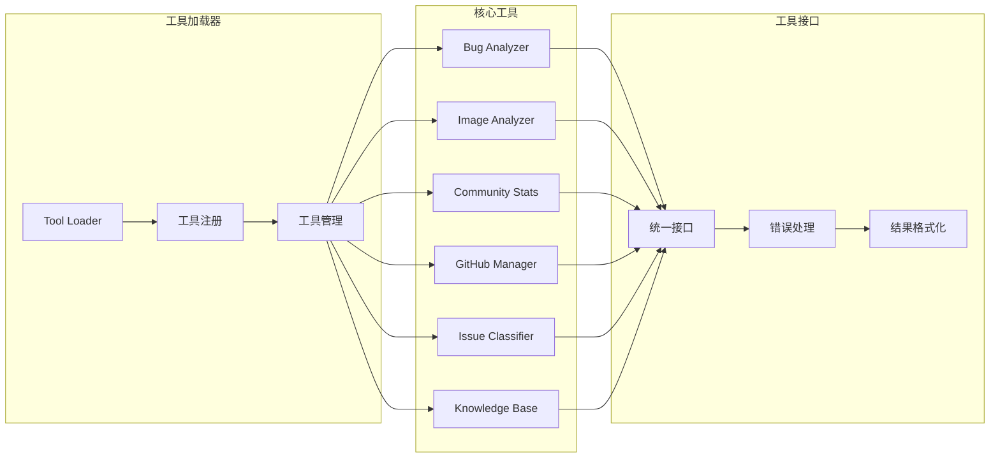
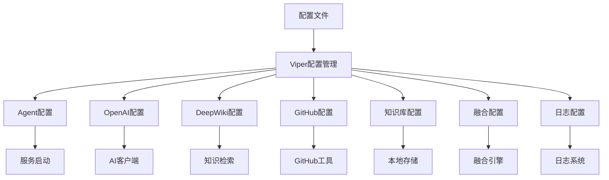
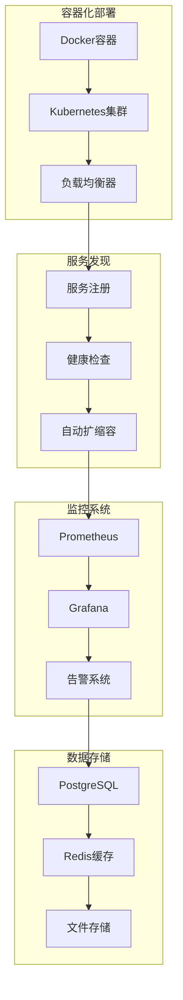

# Higress社区治理智能助手 - 项目架构

## 整体架构图



## 详细组件架构

### 1. 服务层架构

```mermaid
graph LR
    subgraph "HTTP服务器"
        A[Gin Router]
        B[中间件]
        C[认证]
        D[限流]
    end

    subgraph "API接口"
        E[/process - 智能问答]
        F[/analyze - 问题分析]
        G[/stats - 社区统计]
        H[/health - 健康检查]
    end

    subgraph "处理器"
        I[Processor]
        J[Question Handler]
        K[Analysis Handler]
        L[Stats Handler]
    end

    subgraph "工具集成"
        M[Tool Loader]
        N[Bug Analyzer]
        O[Image Analyzer]
        P[Community Stats]
    end

    A --> B
    B --> C
    C --> D
    D --> E
    D --> F
    D --> G
    D --> H
    E --> I
    F --> K
    G --> L
    I --> M
    M --> N
    M --> O
    M --> P
```

### 2. 数据流架构



### 3. 知识融合架构



### 4. 工具集成架构



### 5. 配置管理架构



### 6. 部署架构



## 核心组件说明

### 1. HTTP服务器 (cmd/agent/main.go)
- **功能**: 提供RESTful API接口
- **技术栈**: Gin框架
- **主要接口**:
  - `POST /api/v1/process` - 智能问答
  - `POST /api/v1/analyze` - 问题分析
  - `GET /api/v1/stats` - 社区统计
  - `GET /api/v1/health` - 健康检查

### 2. 处理器 (internal/agent/processor.go)
- **功能**: 核心业务逻辑处理
- **主要方法**:
  - `ProcessQuestion()` - 处理用户问题
  - `retrieveKnowledge()` - 知识检索
  - `fuseKnowledge()` - 知识融合
  - `generateAnswer()` - 生成回答

### 3. OpenAI客户端 (internal/openai/client.go)
- **功能**: 与OpenAI API交互
- **主要方法**:
  - `Chat()` - 发送聊天请求
  - `GenerateText()` - 生成文本
  - `AnalyzeText()` - 分析文本
  - `SummarizeText()` - 总结文本

### 4. 工具层 (tools/)
- **Bug分析器** (`bug_analyzer.go`): 分析错误堆栈
- **图片分析器** (`image_analyzer.go`): 分析截图和错误图片
- **社区统计** (`community_stats.go`): 生成社区活跃度报告
- **GitHub管理器** (`github_manager.go`): 管理GitHub仓库
- **问题分类器** (`issue_classifier.go`): 自动分类Issues
- **知识库管理** (`knowledge_base.go`): 本地知识存储

### 5. 配置管理 (configs/config.yaml)
- **Agent配置**: 基础服务配置
- **OpenAI配置**: AI服务配置
- **DeepWiki配置**: 知识检索配置
- **GitHub配置**: 社区数据配置
- **知识库配置**: 本地存储配置
- **融合配置**: 知识融合参数

## 技术栈

### 后端技术
- **语言**: Go 1.21+
- **Web框架**: Gin
- **配置管理**: Viper
- **日志**: Logrus
- **HTTP客户端**: 标准库
- **JSON处理**: 标准库

### AI和外部服务
- **OpenAI API**: GPT-4o模型
- **GitHub API**: 社区数据获取
- **DeepWiki MCP**: 知识检索

### 部署和运维
- **容器化**: Docker
- **编排**: Docker Compose
- **监控**: Prometheus + Grafana
- **构建**: Makefile
- **测试**: Go testing

## 数据流

### 1. 智能问答流程
1. 用户发送问题到 `/api/v1/process`
2. 服务器解析请求并验证
3. 处理器理解问题并分类
4. 从多个知识源检索相关信息
5. 使用AI融合知识并生成回答
6. 计算置信度并生成建议
7. 返回完整的回答

### 2. 问题分析流程
1. 用户发送错误信息到 `/api/v1/analyze`
2. Bug分析器分析错误堆栈
3. 图片分析器分析相关截图
4. AI生成诊断和解决方案
5. 返回分析结果

### 3. 社区统计流程
1. 用户请求社区统计到 `/api/v1/stats`
2. 从GitHub API获取Issues和PRs数据
3. 计算社区活跃度指标
4. 生成贡献者排行榜
5. 返回统计报告

## 扩展性设计

### 1. 模块化架构
- 每个工具都是独立的模块
- 通过接口进行解耦
- 支持插件式扩展

### 2. 配置驱动
- 所有功能都可通过配置控制
- 支持环境变量覆盖
- 支持多环境配置

### 3. 容器化部署
- 支持Docker容器化
- 支持Kubernetes部署
- 支持水平扩展

### 4. 监控和日志
- 完整的健康检查
- 结构化日志输出
- 性能指标监控

## 安全考虑

### 1. 认证和授权
- API密钥管理
- 访问控制
- 权限验证

### 2. 数据安全
- 敏感信息加密
- 数据传输安全
- 日志脱敏

### 3. 网络安全
- CORS配置
- 请求限流
- DDoS防护

这个架构设计确保了系统的可扩展性、可维护性和高性能，同时提供了丰富的功能和良好的用户体验。 